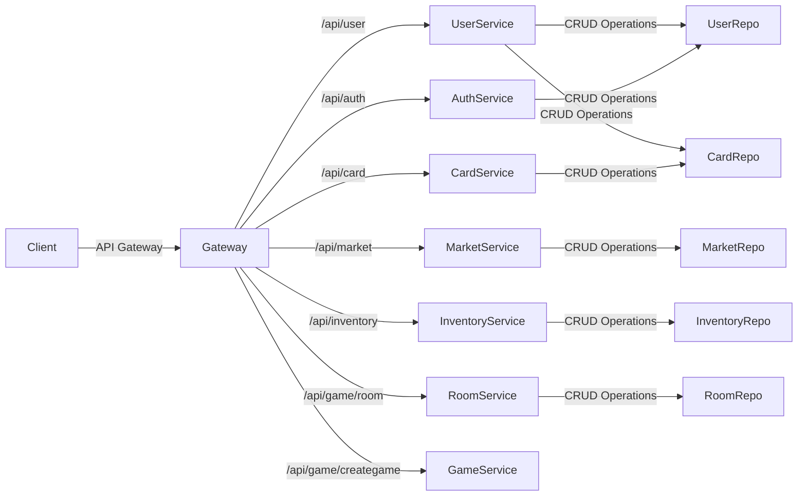
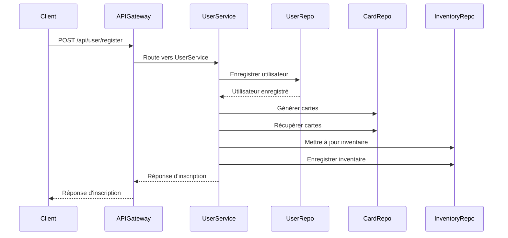
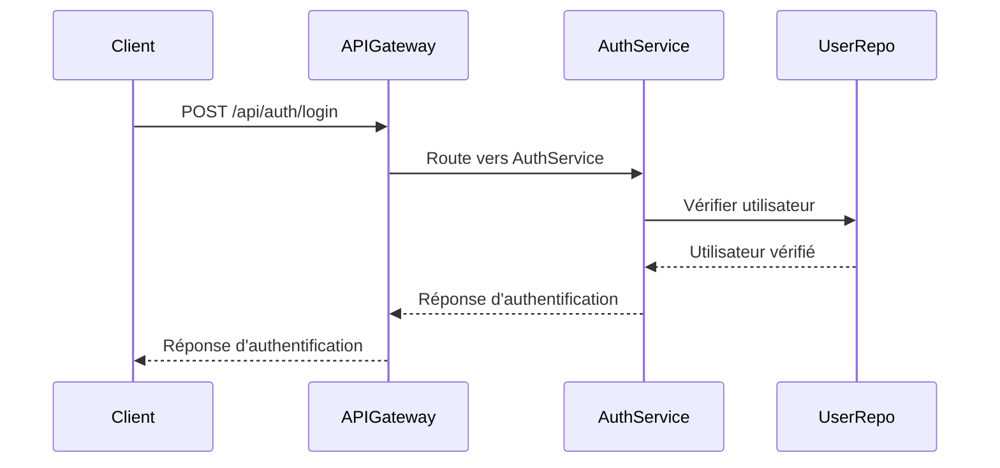
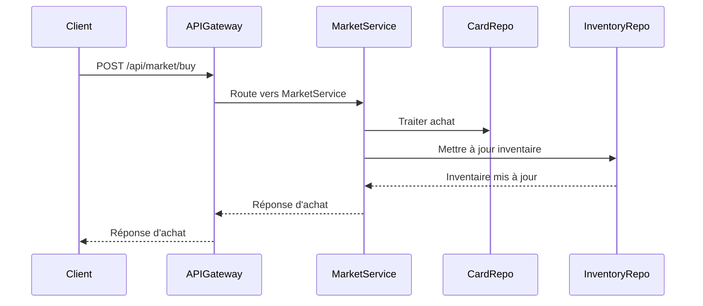
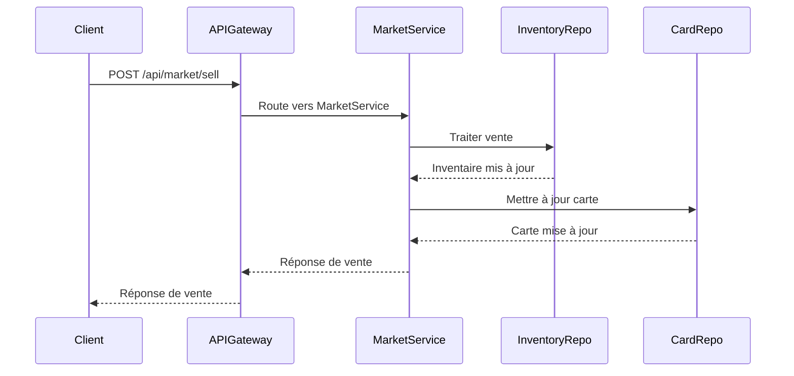
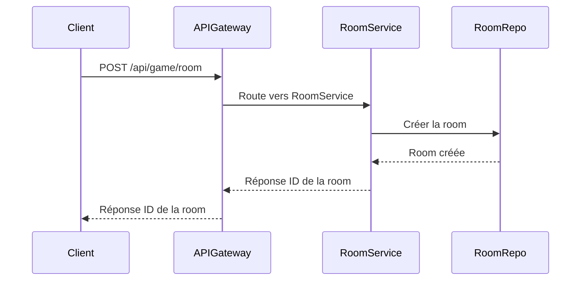

## Schéma haut niveau

```mermaid
graph LR
 Client -->|API Gateway| Gateway
 Gateway -->|/api/user| UserService
 Gateway -->|/api/auth| AuthService
 Gateway -->|/api/market| MarketService
 Gateway -->|/api/card| CardService
 Gateway -->|/api/inventory| InventoryService
 Gateway -->|/api/game/room| RoomService
 Gateway -->|/api/game/creategame| GameService

 UserService -->|CRUD Operations| UserRepo
 UserService -->|CRUD Operations| CardRepo
 AuthService -->|CRUD Operations| UserRepo
 CardService -->|CRUD Operations| CardRepo
 InventoryService -->|CRUD Operations| InventoryRepo
 MarketService -->|CRUD Operations| MarketRepo
 RoomService -->|CRUD Operations| RoomRepo
```
## Schéma bas niveau
### Register

```mermaid
 sequenceDiagram
 participant Client
 participant APIGateway
 participant UserService
 participant UserRepo
 participant CardRepo
 participant InventoryRepo
Client->>APIGateway: POST /api/user/register
APIGateway->>UserService: Route vers UserService
UserService->>UserRepo: Enregistrer utilisateur
UserRepo-->>UserService: Utilisateur enregistré
UserService->>CardRepo: Générer cartes
UserService->>CardRepo: Récupérer cartes
UserService->>InventoryRepo: Mettre à jour inventaire
UserService->>InventoryRepo: Enregistrer inventaire
UserService-->>APIGateway: Réponse d'inscription
APIGateway-->>Client: Réponse d'inscription
```
### Login

```mermaid
sequenceDiagram
participant Client
participant APIGateway
participant AuthService
participant UserRepo
Client->>APIGateway: POST /api/auth/login
APIGateway->>AuthService: Route vers AuthService
AuthService->>UserRepo: Vérifier utilisateur
UserRepo-->>AuthService: Utilisateur vérifié
AuthService-->>APIGateway: Réponse d'authentification
APIGateway-->>Client: Réponse d'authentification
```
### Market Buy

```mermaid
sequenceDiagram
participant Client
participant APIGateway
participant MarketService
participant CardRepo
participant InventoryRepo
Client->>APIGateway: POST /api/market/buy
APIGateway->>MarketService: Route vers MarketService
MarketService->>CardRepo: Traiter achat
MarketService->>InventoryRepo: Mettre à jour inventaire
InventoryRepo-->>MarketService: Inventaire mis à jour
MarketService-->>APIGateway: Réponse d'achat
APIGateway-->>Client: Réponse d'achat
```
### Market Sell

```mermaid
sequenceDiagram
participant Client
participant APIGateway
participant MarketService
participant InventoryRepo
participant CardRepo
Client->>APIGateway: POST /api/market/sell
APIGateway->>MarketService: Route vers MarketService
MarketService->>InventoryRepo: Traiter vente
InventoryRepo-->>MarketService: Inventaire mis à jour
MarketService->>CardRepo: Mettre à jour carte
CardRepo-->>MarketService: Carte mise à jour
MarketService-->>APIGateway: Réponse de vente
APIGateway-->>Client: Réponse de vente
```
### Room

```mermaid
sequenceDiagram
participant Client
participant APIGateway
participant RoomService
participant RoomRepo
Client->>APIGateway: POST /api/game/room
APIGateway->>RoomService: Route vers RoomService
RoomService->>RoomRepo: Créer la room
RoomRepo-->>RoomService: Room créée
RoomService-->>APIGateway: Réponse ID de la room
APIGateway-->>Client: Réponse ID de la room
```
